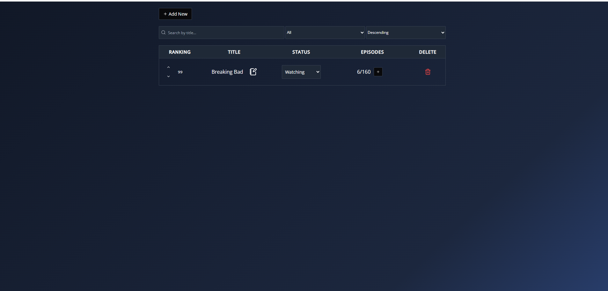

# Series Tracker

Este proyecto es una aplicación web para gestionar series, permitiendo a los usuarios realizar un seguimiento de las series que están viendo, han completado, o planean ver.

## Requisitos previos

- Docker y Docker Compose instalados en tu sistema.
- Navegador web.

## Instrucciones para ejecutar el proyecto

1. Clona este repositorio en tu máquina local:

2. Construye y levanta los servicios con Docker Compose:
   ```
   docker-compose up --build
   ```

3. Accede a la aplicación en tu navegador en la URL:
   ```
   http://localhost
   ```

4. La documentación Swagger estará disponible en:
   ```
   http://localhost:8080/swagger/index.html
   ```

## Captura de pantalla



## Notas adicionales

- Asegúrate de que los puertos `80` y `8080` estén disponibles en tu máquina.
- Si necesitas reiniciar los contenedores, usa:
  ```bash
  docker-compose down
  docker-compose up --build
  ```